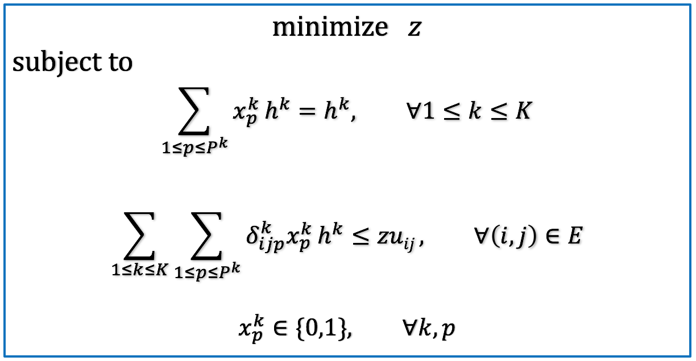
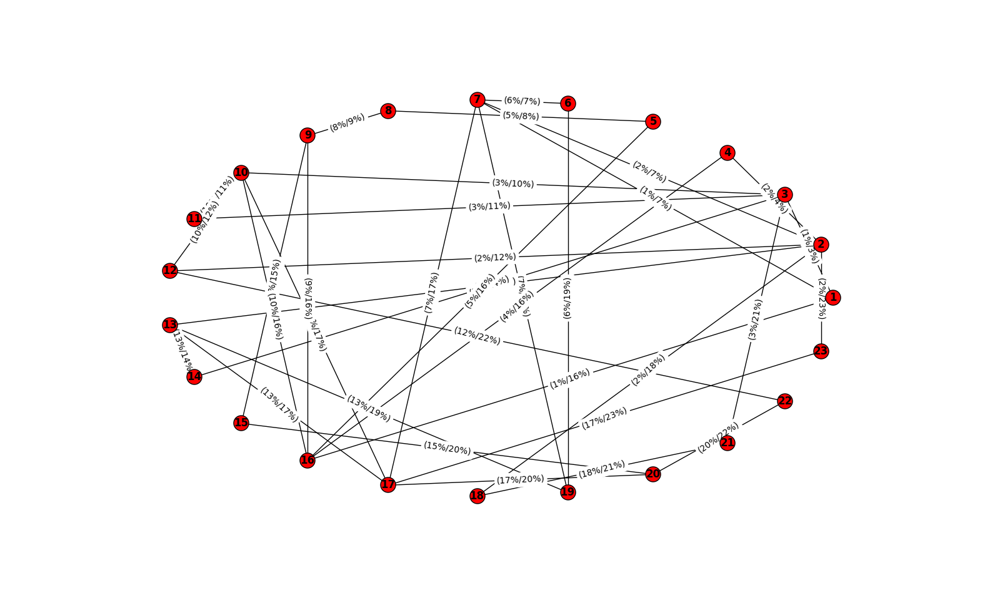
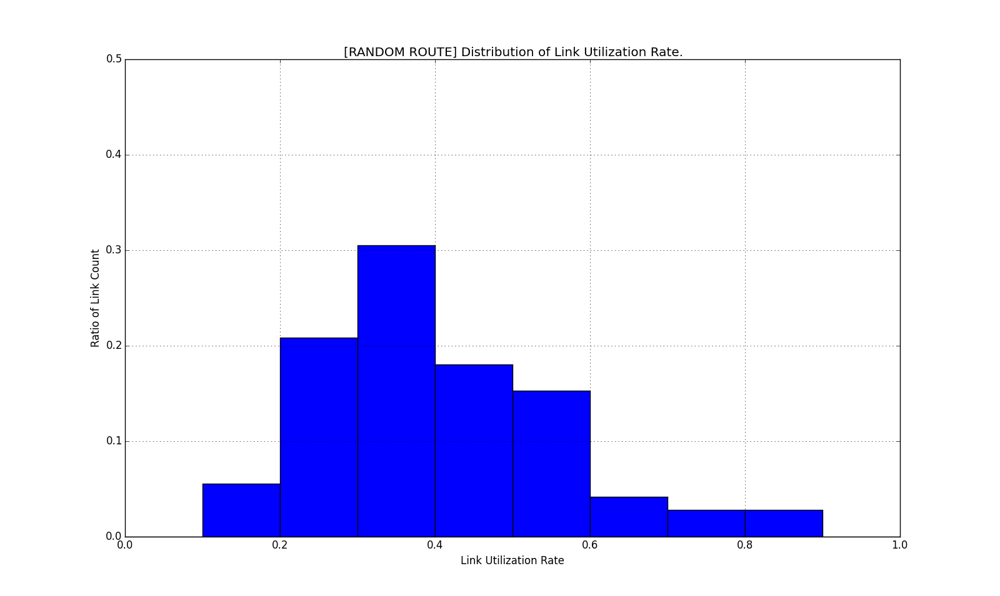
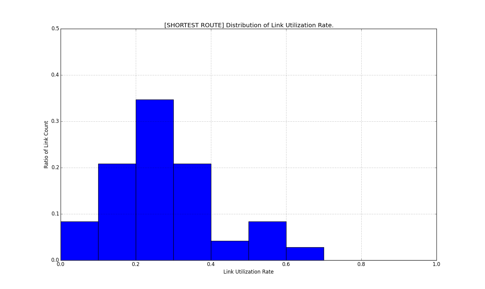
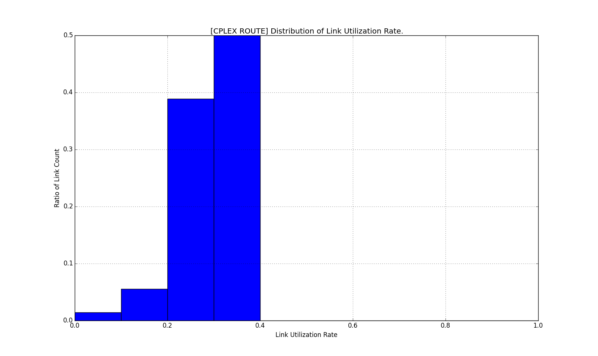

Link-Path Based, Multi-Commodity Flow, Single Routing, Load Balance, MIP Model, Implemented by Python and CPLEX OPL 
---

This project reads nodes and links from giving files, creates and visualizes topology using NetworkX, and implements Yen's Algorithm to generate the top-k-shortest-paths for all source-destination pairs commodity flows, and dumps necessary infomation to *data/\*.dat* and *cplex/\*.dat*. 

The link-path based MIP model has *N(N-1)* commodity flows, and there exists *|P<sup>k</sup>|* candidate paths for each commodity flow *k* (i.e. *x<sup>k</sup><sub>p</sub>, 1<=k<=K, 1<=p<=|P<sup>k</sup>|*), while only one path could be selected to transfer *k*-th commodity flow. The objective is finding routing strategies for all commodity flows to minimize the maximum link utilization *z*, which we called **Load Balance**. The LP model is shown as following:

<center></img></center>

The CPLEX OPL implementation of this LP problem can be found at *cplex/mcf.mod*.

# Requirement

* IBM ILOG CPLEX Optimization Studio V12.6.0
* Python 2.7
* NetworkX 2.0
* NumPy 1.14.2
* matplotlib 1.4.3

# How to Use?

## Data Format

Put *nodes.txt* and *links.txt* in *data/*, you can refer to *data/topo1/nodes.txt* and *data/topo1/links.txt* for more details about input format. Note that:

* Node id is an integer and starts from 1.
* All the links of graph is directed and duplex. For example, we may have duplex links (s,t) and (t,s), but only (s,t) is specified in *data/links.txt*.

## Prepare Data for CPLEX Optimizer

Execute:

```
./prepare.py
```

This file prepares data for CPLEX optimizer. The files will be saved to *data/* and then copied to *cplex/*, includes:

1. **base.dat:** includes NumNodes, NumLinks, NumPaths.
2. **paths.dat(optional):** includes Paths. Specify the selected candidate paths for each source-destination pair.
3. **num\_nodes\_in\_paths.dat(optional):** includes NumNodesInEachPath. Specify the number of nodes contained in each path.
4. **num\_paths.dat(optional):** includes NumPaths. Specify the number of paths contained in each source-destination pair.
5. **demand.dat:** includes Demands. Specify the demand matrix.
6. **delta.dat:** includes Delta. Specify the incidence matrix between links and paths. The values are 0 or 1.
7. **capacity.dat:** includes Capacity. Specify the link capacity for each link.

Only data which are needed by *cplex/mcf.mod* is copied to *cplex/*, including: 

1. **base.dat**
2. **demand.dat**
3. **capacity.dat**
4. **delta.dat**

## Solve the LP Model

Copy *cplex/mcf.mod* and *cplex/\*.dat* to CPLEX OPL project, solve the MIP problem on IBM ILOG CPLEX Optimization Studio, and paste the solution to *cplex/solution.txt*.  

**NOTE:** Set the maximum running time limit, if needed, for a call to MIP optimizer:

```
execute PARAMS {
  cplex.tilim = 100;
}
```

## Validate the Solution and Compare the Performance

Execute:

```
./validate.py
```

This file reads solution from *cplex/solution.txt*, validates the solution, and compares the performance of random selected paths (from
top-k-shortest paths), shortest paths and CPLEX optimized paths. The link utilization distributions are figured below.

# Result

**Output:**

```
[CPLEX ROUTE] Maximum link utilization, (16,1): 0.385
[SHORTEST ROUTE] Maximum link utilization, (10,16): 0.617
[RANDOM ROUTE] Maximum link utilization, (10,16): 0.893
```

The link utilization of *RANDOM ROUTE* reachs 0.787 in 24107702 samples. The running log is shown below:

```
[Iteration 180] current: 0.975, optimal: 0.535
[Iteration 4237] current: 0.913, optimal: 0.535
[Iteration 14935] current: 0.893, optimal: 0.535
[Iteration 23375] current: 0.871, optimal: 0.535
[Iteration 185111] current: 0.867, optimal: 0.535
[Iteration 191965] current: 0.862, optimal: 0.535
[Iteration 347667] current: 0.814, optimal: 0.535
[Iteration 5847911] current: 0.799, optimal: 0.535
[Iteration 8103900] current: 0.798, optimal: 0.535
[Iteration 15839001] current: 0.796, optimal: 0.535
[Iteration 19867917] current: 0.789, optimal: 0.535
[Iteration 24107702] current: 0.787, optimal: 0.535
```

**Topology and CPLEX Optimized Utilization:**

<center></img></center>

**Distribution of Link Utilization for Random Selected Paths (from Top-k-Shortest-Paths):**

<center></img></center>

**Distribution of Link Utilization for Shortest Paths:**

<center></img></center>

**Distribution of Link Utilization for CPLEX Optimized Paths:**

<center></img></center>

# Reference

1. Yen, Jin Y. (1970). "[An algorithm for finding shortest routes from all source nodes to a given destination in general networks](http://mathscinet.ams.org/mathscinet-getitem?mr=0253822)". Quarterly of Applied Mathematics. 27 (4): 526–530
2. Yen, Jin Y. (Jul 1971). "[Finding the k Shortest Loopless Paths in a Network](https://pubsonline.informs.org/doi/abs/10.1287/mnsc.17.11.712)". Management Science. 17 (11): 712–716.
3. [Yen's algorithm](https://en.wikipedia.org/wiki/Yen%27s_algorithm). Wikipedia.
4. Pent00. [YenKSP](https://github.com/Pent00/YenKSP). Github.
5. [PPT](http://www.doc88.com/p-3367340003756.html) on Theoretical Basis of Communication Network of UESTC.

**NOTE:** Some bugs exist in Pent00's project YenKSP, more details can be found in "Issues" page. 

* Refer to [GGurtner's pull requests](https://github.com/Pent00/YenKSP/pull/3) to update <code>distances</code> in each iteration. 
* Refer to [Yen's algorithm](https://en.wikipedia.org/wiki/Yen%27s_algorithm) and add following codes, otherwise you may get paths with loop.

```
for each node rootPathNode in rootPath except spurNode:
    remove rootPathNode from Graph;
```

Bugs were fixed in this project, refer to function <code>ksp.k\_shortest_paths</code> for more details.

---
<center>Copyright © 2018 Zonghang Li</center>
